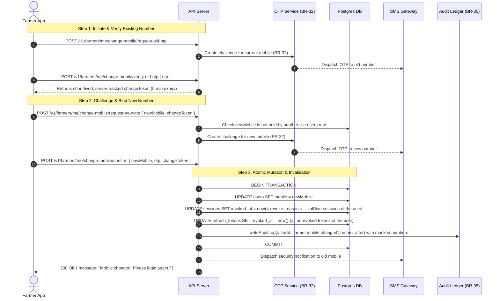

# Design Note: Self-Service Mobile Number Change (Module 9)

**Status:** PROPOSED / DESIGN ONLY — Awaiting Owner Approval  
**Date:** 2026-10-08  
**Author:** Backend Architecture Team  
**Governing Rule:** BR-33 (Aadhaar and mobile are locked fields)

---

## 1. Problem Statement & Constraint Conflict
Under **BR-33**, both Aadhaar number and registered mobile number are locked post-approval:
> "A farmer's Aadhaar number and registered mobile number cannot be changed by the farmer, by TOHFA_ADMIN, or by any warehouse role. Only SUPER_ADMIN may change them, and the change is audit-logged."

Allowing a farmer to change their registered mobile number self-service directly contradicts BR-33 as written. Since the mobile number is the primary authentication credential (`/v1/auth/otp/request` + `/v1/auth/otp/verify`) and account recovery anchor, an unconstrained self-service update introduces severe account takeover (ATO) risk.

---

## 2. Proposed Two-Step Verification Flow
To reconcile self-service updates with security requirements, the following flow is proposed:

### 2.1 Where the data lives today (verified against `db/migrations/0002_identity_and_access.sql` and `0003_farmers_and_farms.sql`)
- **The mobile number is `users.mobile`, and only there.** `farmers` has no mobile column, so there is nothing to update on `farmers`. It is E.164 (`users_mobile_e164_chk`) and unique among live rows (`uq_users_mobile_live`, a partial unique index on `mobile WHERE deleted_at IS NULL`). The uniqueness pre-check is a courtesy for a clean `MOBILE_ALREADY_REGISTERED`; the index is the real guarantee, so the confirm step must also translate a unique-violation into the same error (two farmers can race for one number).
- **Sessions are `sessions` and `refresh_tokens`; there is no `user_sessions` table.** Sessions are revoked, not deleted: `sessions.revoked_at` / `revoked_by` / `revoke_reason` for every live session of the user, and `refresh_tokens.revoked_at` for every unrevoked token of those sessions.
- **The OTP purpose already exists.** `otp_verifications.purpose` allows `'MOBILE_CHANGE'` (alongside `REGISTRATION`, `LOGIN`, `PASSWORD_RESET`, `DELIVERY`, `PICKUP`), so no CHECK change is needed for the OTP challenges themselves. `otp_verifications` carries `mobile`, `code_hash`, `attempts` / `max_attempts`, `locked_at`, `consumed_at`, `resend_count` and `last_sent_at`, which cover BR-32a/b for both challenges.

### 2.2 The `changeToken` needs server-side state
A signed JWT cannot be single-use on its own: nothing stops it being presented twice before it expires. "Single-use" therefore requires server-side state that `confirm` consumes atomically (for example a hashed token recorded against the user and consumed with a conditional `UPDATE ... WHERE consumed_at IS NULL`, so a replay updates zero rows). `otp_verifications` has no column to hold a token hash, so this needs either a new column or a new table, which is a migration the implementing story must write; this note does not pick one. Until then, "single-use" in this note means "consumable once, tracked server-side", not "a JWT".

---

## 3. Endpoints Specification (Proposed)

| Method | Path | Permission | Purpose |
|---|---|---|---|
| `POST` | `/v1/farmers/me/change-mobile/request-old-otp` | `farmer.profile.edit_own` | Initiates flow; sends OTP to existing registered mobile. |
| `POST` | `/v1/farmers/me/change-mobile/verify-old-otp` | `farmer.profile.edit_own` | Verifies old number OTP; issues a single-use `changeToken` (5 min TTL, server-tracked so it can be consumed once; see 2.2). |
| `POST` | `/v1/farmers/me/change-mobile/request-new-otp` | `farmer.profile.edit_own` | Sends OTP to target new mobile number (enforces uniqueness). |
| `POST` | `/v1/farmers/me/change-mobile/confirm` | `farmer.profile.edit_own` | Verifies new number OTP + `changeToken`; commits change; revokes sessions. |

---

## 4. Error Codes & Failure Modes

| Error Code | HTTP Status | Condition |
|---|---|---|
| `OTP_INVALID` | 422 | Wrong 6-digit code provided. |
| `OTP_LOCKED` | 429 | Exceeded 3 failed attempts (BR-32a). |
| `OTP_RESEND_TOO_SOON` | 429 | Cooldown window active (< 60s, BR-32b). |
| `MOBILE_ALREADY_REGISTERED` | 409 | New mobile number belongs to another active account. |
| `CHANGE_TOKEN_INVALID` | 401 | `changeToken` expired, unknown, or already consumed. |
| `FIELD_LOCKED` | 403 | Attempting to bypass flow via standard `PATCH /v1/farmers/me`. |

---

## 5. Security Invariants
1. **Re-authentication Required:** Following a mobile change, all of the user's sessions (`sessions.revoked_at`) and refresh tokens (`refresh_tokens.revoked_at`) are immediately revoked. The farmer must log in anew with the updated phone number.
2. **Old Number Notice:** An SMS advisory is dispatched to the old phone number informing them of the change and directing them to Tohfa Support if unauthorized.
3. **Audit Trail:** Immutable append-only audit entry written under `audit_log` with before/after state with before/after state. Mobile numbers are written masked (last four digits only, the same convention as BR-33b / BR-53 for Aadhaar and account numbers), in the audit row as in user-facing reports; the full number is not stored in `audit_log`.

---

## 6. Open Questions for the Owner
1. **Lost SIM / Stolen Phone Recovery:** If the farmer lost their SIM and cannot receive an OTP on the old number, should they fall back to in-person / Farmer Admin KYC verification, or Super Admin manual intervention?
2. **Frequency Throttling:** Should there be a cooldown period (e.g. at most once every 90 days) on self-service mobile number updates?
3. **Pending Payout Safeguard:** Should changing a mobile number freeze automated bank payouts or wallet debits for 24-48 hours to prevent fraud drain?
